# mAP计算过程

2020年11月5日[视频](https://www.bilibili.com/video/av583749910/)

----

## 引出问题

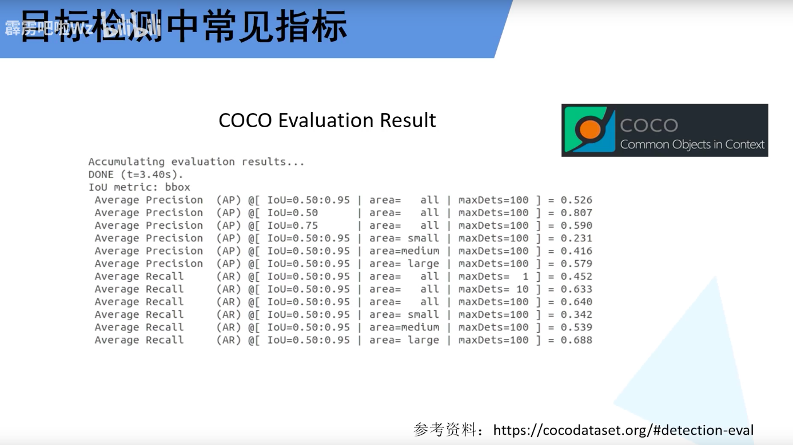

## 基础概念

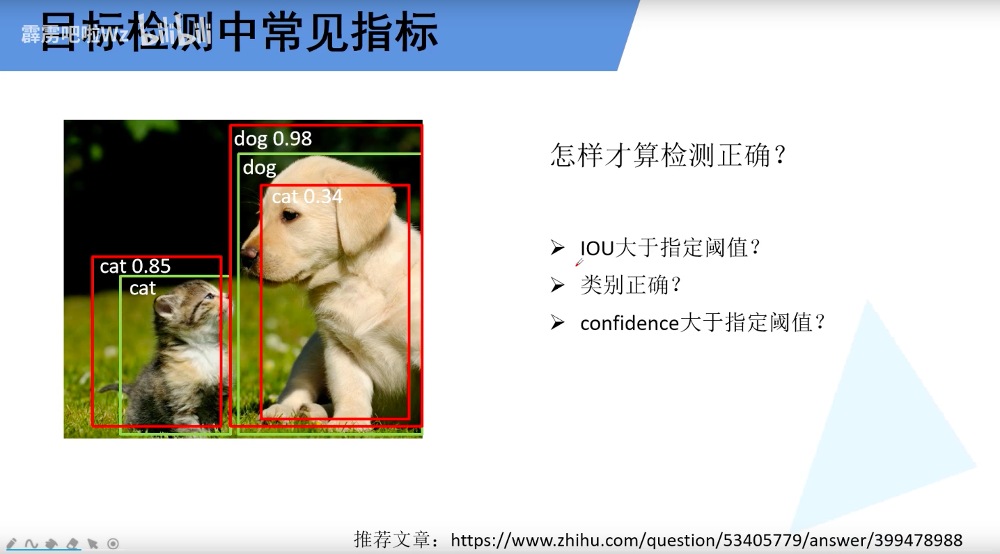

> 备注：绿色代表真实框，红色代表预测框。

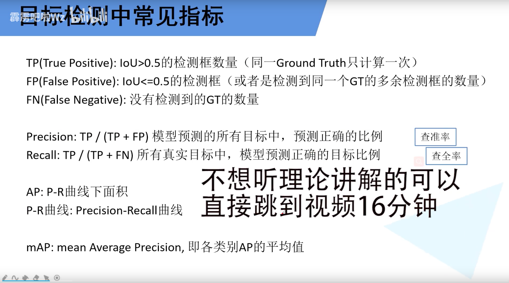

> 备注：
>
> TP：当预测边界框和真实框的IOU大于0.5  的数量。e g.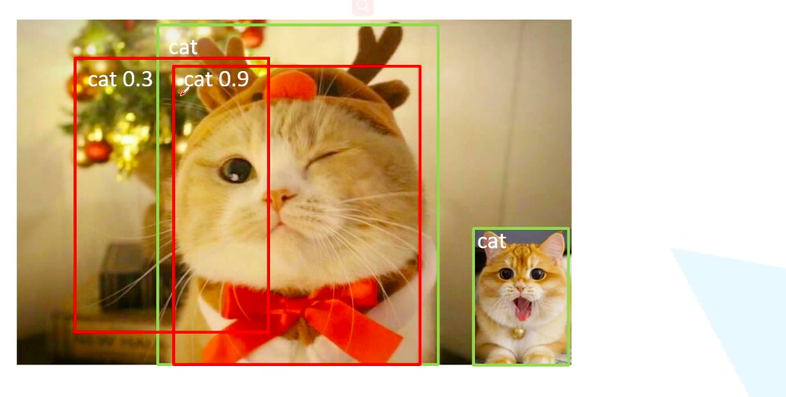
>
> FP:假阳性，不是目标，你预测为目标。
>
> FN：漏检目标个数，比如上图中的右下角。
>
> Precision和recall的例子：
>
> 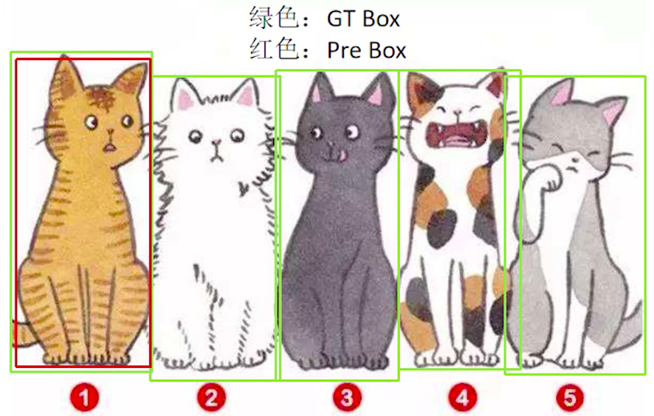
>
> P=1，R小
>
> 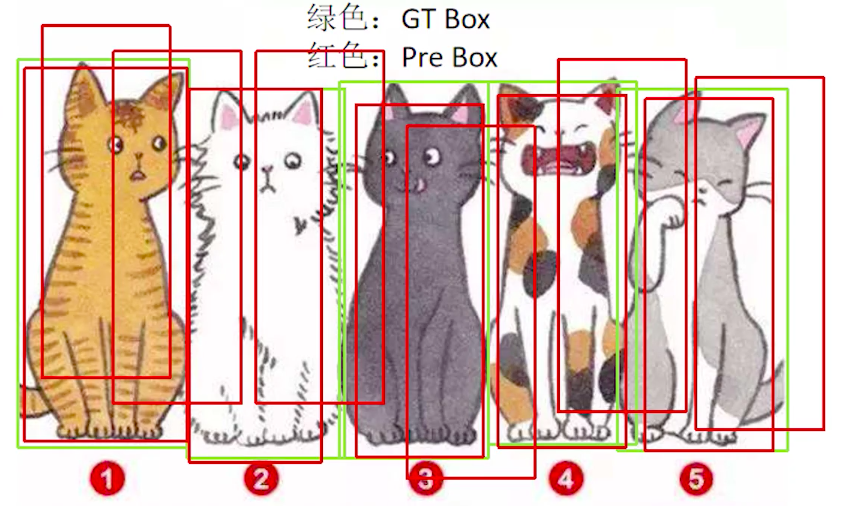
>
> R=1，P小

## 求AP

> 假设现在模型训练完毕，然后用模型预测，上面三张图是验证集。

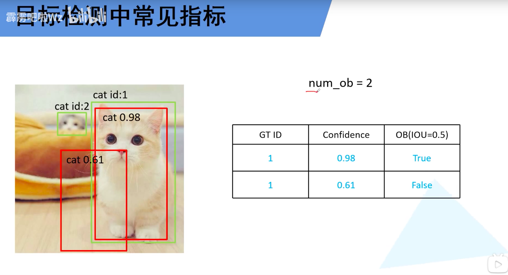

> 第一张验证图片。
>
> Num_ob表示真实标签总共有多少个object
>
> 需要有这张图本类目标的个数，num_ob = 2 。
>
> 表格中 GT ID表示真实标签的ID， confidence表是预测的内容的置信度，OB表示预测和真实的IOU是否满足要求。

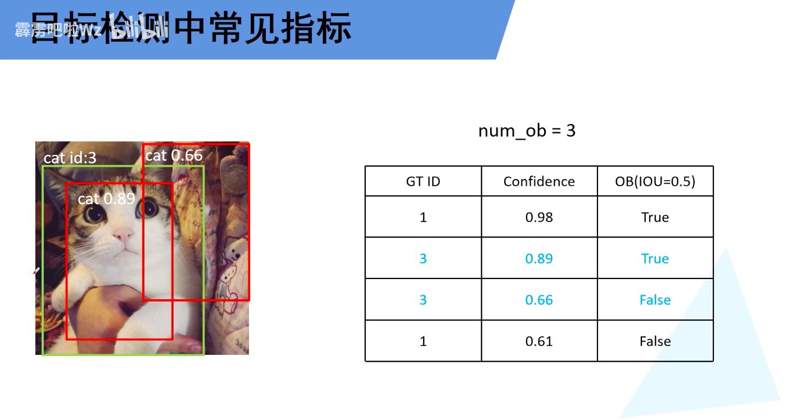

> 第2张验证图片

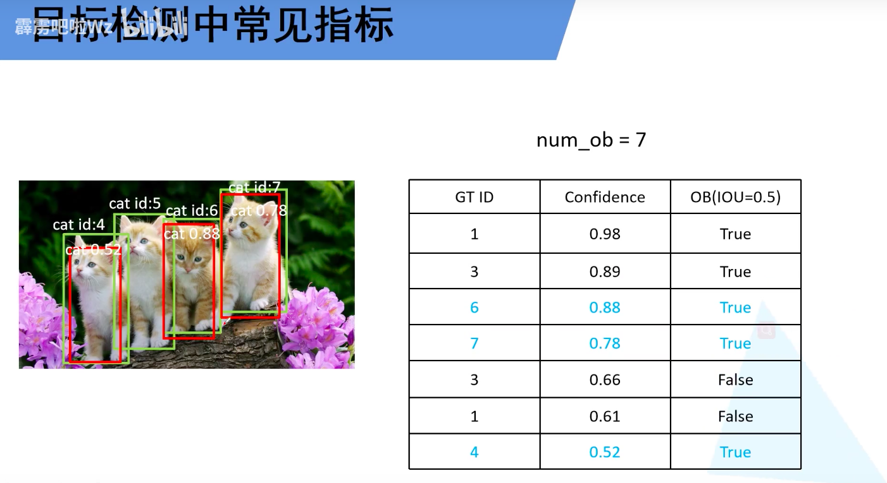

> 第3张图片

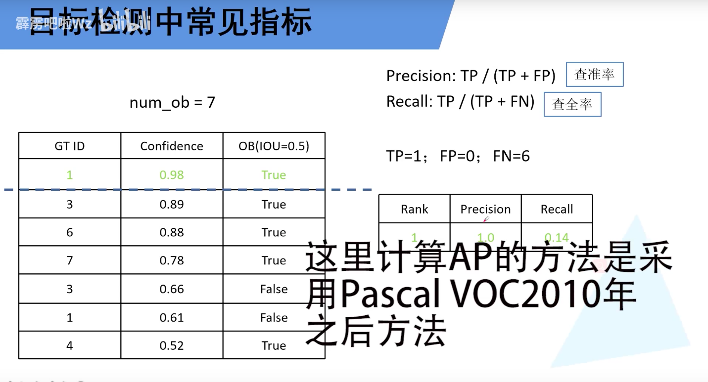

> 针对不同的Confidence计算不同的Precision、Recall。

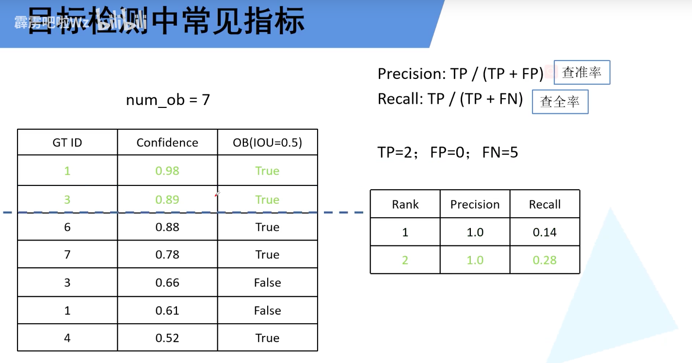

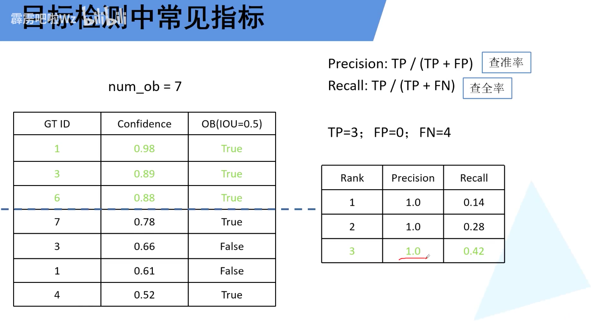

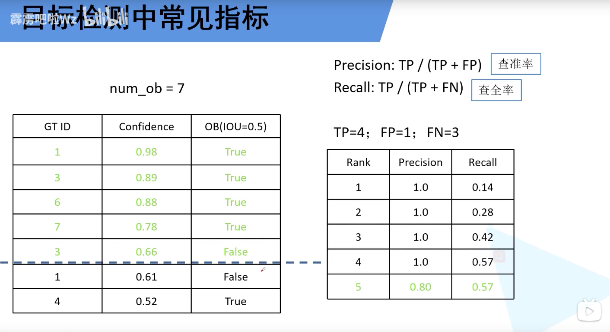

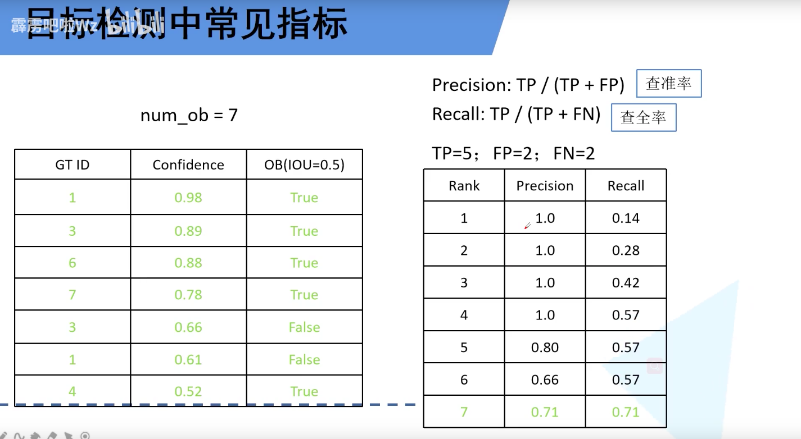

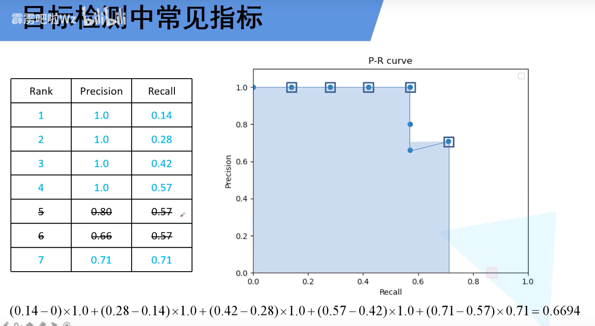

> 从上一步计算出PR列表，然后需要去重（recall相同的，取最大），例如本例中5，6.

## COCO评价指标含义

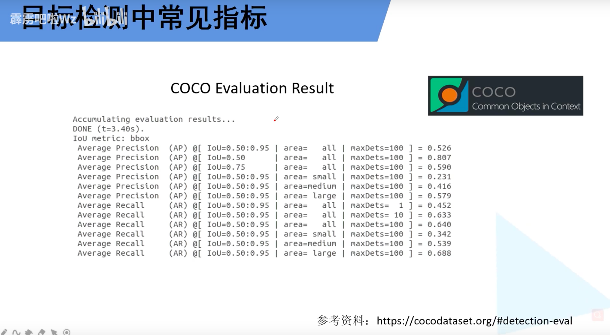

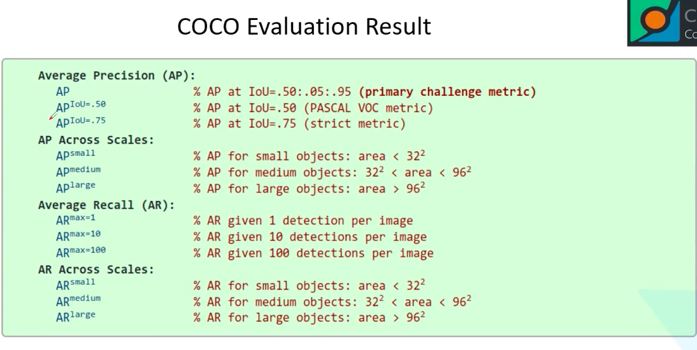

> 上图AP表示，IOU分别为（0.5，0.95，0.05）计算多个mAP的值，然后平均。
>
> 不同例子，针对的评价指标不同。

## 参考代码

