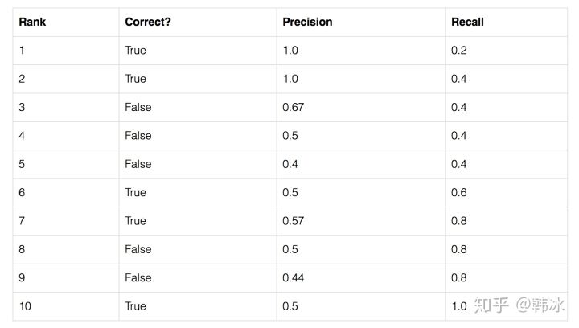
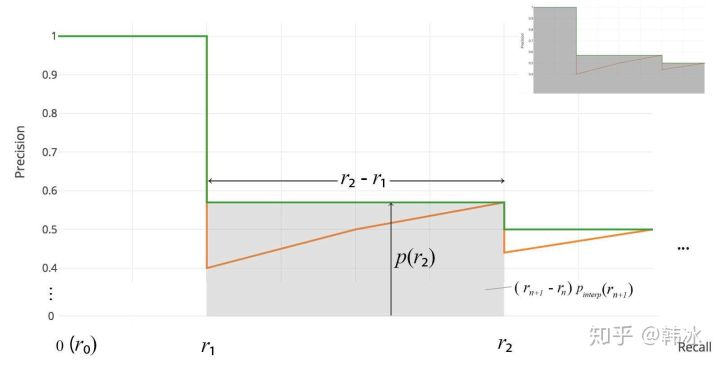

# mAP计算过程

2020年11月5日[视频](https://www.bilibili.com/video/av583749910/)

----

## 引出问题


## 基础概念


> 备注：绿色代表真实框，红色代表预测框。


> 备注：
>
> TP：当预测边界框和真实框的IOU大于0.5  的数量。e g.
>
> FP:假阳性，不是目标，你预测为目标。
>
> FN：漏检目标个数，比如上图中的右下角。
>
> Precision和recall的例子：
>
> 
>
> P=1，R小
>
> 
>
> R=1，P小

## 求AP


> 假设现在模型训练完毕，然后用模型预测，上面三张图是验证集。


> 第一张验证图片。
>
> Num_ob表示真实标签总共有多少个object
>
> 需要有这张图本类目标的个数，num_ob = 2 。
>
> 表格中 GT ID表示真实标签的ID， confidence表是预测的内容的置信度，OB表示预测和真实的IOU是否满足要求。


> 第2张验证图片


> 第3张图片


> 针对不同的Confidence计算不同的Precision、Recall。


> 从上一步计算出PR列表，然后需要去重（recall相同的，取最大），例如本例中5，6.

## COCO评价指标含义


> 上图AP表示，IOU分别为（0.5，0.95，0.05）计算多个mAP的值，然后平均。
>
> 不同例子，针对的评价指标不同。

## 参考代码

**AP，mAP计算详解（代码全解）**

### 定义

#### Accuracy：准确率

✔️ 准确率=预测正确的样本数/所有样本数，即预测正确的样本比例（包括预测正确的正样本和预测正确的负样本，不过在目标检测领域，没有预测正确的负样本这一说法，所以目标检测里面没有用Accuracy的）。

![[公式]](https://www.zhihu.com/equation?tex=Accuracy%3D%5Cfrac%7B%5Ctext+%7BTruePositive%7D%2B%5Ctext+%7BTrueNegative%7D%7D%7B%5Ctext+%7BAllSamples%7D%7D)

#### Precision：查准率

✔️ recision表示某一类样本预测有多准。

✔️ Precision针对的是某一类样本，如果没有说明类别，那么Precision是毫无意义的（有些地方不说明类别，直接说Precision，是因为二分类问题通常说的Precision都是正样本的Precision）。

![[公式]](https://www.zhihu.com/equation?tex=Precision+%3D%5Cfrac%7B%5Ctext+%7BTruePositives%7D%7D%7B%5Ctext+%7BAll%7D+%5Ctext+%7BDetections%7D%7D++%3D%3D%3E+Precision+%3D+TP%2F%28TP%2BFP%29)

#### Recall：召回率

✔️ Recall和Precision一样，脱离类别是没有意义的。说道Recall，一定指的是某个类别的Recall。Recall表示某一类样本，预测正确的与所有Ground Truth的比例。

✍️ **Recall计算的时候，分母是Ground Truth中某一类样本的数量，而Precision计算的时候，是预测出来的某一类样本数。**

![[公式]](https://www.zhihu.com/equation?tex=Recall%3D%5Cfrac%7B%5Ctext+%7BTruePositives%7D%7D%7B%5Ctext+%7BAllGroundTruths%7D%7D++%3D%3D%3E+Recall+%3D+TP%2F%28TP%2BFN%29)

#### F1 Score：平衡F分数

F1分数，它被定义为查准率和召回率的调和平均数

![[公式]](https://www.zhihu.com/equation?tex=F_%7B1%7D%3D2+%5Ccdot+%5Cfrac%7B%5Ctext+%7B+precision+%7D+%5Ccdot+%5Ctext+%7Brecall%7D%7D%7B%5Ctext+%7Bprecision%7D%2B%5Ctext+%7Brecall%7D%7D)

![[公式]](https://www.zhihu.com/equation?tex=F+1%3D2+T+P+%2F%282+T+P%2BF+N%2BF+P%29)

更加广泛的会定义 ![[公式]](https://www.zhihu.com/equation?tex=F_%7B%5Cbeta%7D) 分数，其中 ![[公式]](https://www.zhihu.com/equation?tex=F_%7B2%7D) 和 ![[公式]](https://www.zhihu.com/equation?tex=F_%7B0.5%7D) 分数在统计学在常用，并且， ![[公式]](https://www.zhihu.com/equation?tex=F_%7B2%7D) 分数中，召回率的权重大于查准率，而 ![[公式]](https://www.zhihu.com/equation?tex=F_%7B0.5%7D) 分数中，则相反。

![[公式]](https://www.zhihu.com/equation?tex=F_%7B%5Cbeta%7D%3D%5Cleft%281%2B%5Cbeta%5E%7B2%7D%5Cright%29+%5Ccdot+%5Cfrac%7B%5Ctext+%7Bprecision%7D+%5Ccdot+%5Ctext+%7Brecall%7D%7D%7B%5Cleft%28%5Cbeta%5E%7B2%7D+%5Ccdot+%5Ctext+%7Bprecision%7D%5Cright%29%2B%5Ctext+%7Brecall%7D%7D)

#### AP: Average Precision

以Recall为横轴，Precision为纵轴，就可以画出一条PR曲线，PR曲线下的面积就定义为AP，即：


PR曲线


由于计算积分相对困难，因此引入插值法，计算AP公式如下：

![[公式]](https://www.zhihu.com/equation?tex=%5Csum_%7Bk%3D1%7D%5E%7BN%7D+%5Cmax+_%7B%5Ctilde%7Bk%7D+%5Cgeq+k%7D+P%28%5Ctilde%7Bk%7D%29+%5CDelta+r%28k%29)


计算面积：


原理：

![[公式]](https://www.zhihu.com/equation?tex=%5Cbegin%7Barray%7D%7Bl%7D%7BA+P%3DA+1%2BA+2%2BA+3%2BA+4%7D%5C%5C+%5C%5C%7BA+1%3D%280.0666-0%29+%5Ctimes+1%3D0.0666%7D+%5C%5C+%7BA+2%3D%280.1333-0.0666%29+%5Ctimes+0.6666%3D0.04446222%7D+%5C%5C+%7BA+3%3D%280.4-0.1333%29+%5Ctimes+0.4285%3D0.11428095%7D+%5C%5C+%7BA+4%3D%280.4666-0.4%29+%5Ctimes+0.3043%3D0.02026638%7D+%5C%5C+%7BA+P%3D0.0666%2B0.04446222%2B0.11428095%2B0.02026638%7D+%5C%5C+%7BA+P%3D0.24560955%7D+%5C%5C+%7BA+P%3D24.56+%5C%25%7D%5Cend%7Barray%7D)

### 代码详解

#### computer_mAP.py

```python
from voc_eval import voc_eval
import os

mAP = []
# 计算每个类别的AP
for i in range(8):
    class_name = str(i)  # 这里的类别名称为0,1,2,3,4,5,6,7
    rec, prec, ap = voc_eval('path/{}.txt', 'path/Annotations/{}.xml', 'path/test.txt', class_name, './')
    print("{} :\t {} ".format(class_name, ap))
    mAP.append(ap)

mAP = tuple(mAP)

print("***************************")
# 输出总的mAP
print("mAP :\t {}".format( float( sum(mAP)/len(mAP)) ))
```

#### AP计算

```python
import numpy as np

def voc_ap(rec, prec, use_07_metric=False):
    """ ap = voc_ap(rec, prec, [use_07_metric])
    Compute VOC AP given precision and recall.
    If use_07_metric is true, uses the
    VOC 07 11 point method (default:False).
    """
    # 针对2007年VOC，使用的11个点计算AP，现在不使用
    if use_07_metric:
        # 11 point metric
        ap = 0.
        for t in np.arange(0., 1.1, 0.1):
            if np.sum(rec >= t) == 0:
                p = 0
            else:
                p = np.max(prec[rec >= t])
            ap = ap + p / 11.
    else:
        # correct AP calculation
        # first append sentinel values at the end
        mrec = np.concatenate(([0.], rec, [1.]))  #[0.  0.0666, 0.1333, 0.4   , 0.4666,  1.] 
        mpre = np.concatenate(([0.], prec, [0.])) #[0.  1.,     0.6666, 0.4285, 0.3043,  0.]

        # compute the precision envelope
        # 计算出precision的各个断点(折线点)
        for i in range(mpre.size - 1, 0, -1):
            mpre[i - 1] = np.maximum(mpre[i - 1], mpre[i])  #[1.     1.     0.6666 0.4285 0.3043 0.    ]

        # to calculate area under PR curve, look for points
        # where X axis (recall) changes value
        i = np.where(mrec[1:] != mrec[:-1])[0]  #precision前后两个值不一样的点
        print(mrec[1:], mrec[:-1])
        print(i) #[0, 1, 3, 4, 5]

        # AP= AP1 + AP2+ AP3+ AP4
        ap = np.sum((mrec[i + 1] - mrec[i]) * mpre[i + 1])
    return ap

rec = np.array([0.0666, 0.1333,0.1333, 0.4, 0.4666])
prec = np.array([1., 0.6666, 0.6666, 0.4285, 0.3043])
ap = voc_ap(rec, prec)

print(ap) #输出：0.2456
```

#### voc_eval详解

**1. Annotation**

```html
<annotation>
    <folder>VOC2007</folder>
    <filename>009961.jpg</filename>
    <source>
        <database>The VOC2007 Database</database>
        <annotation>PASCAL VOC2007</annotation>
        <image>flickr</image>
        <flickrid>334575803</flickrid>
    </source>
    <owner>
        <flickrid>dictioncanary</flickrid>
        <name>Lucy</name>
    </owner>
    <size><!--image shape-->
        <width>500</width>
        <height>374</height>
        <depth>3</depth>
    </size>
    <segmented>0</segmented><!--是否有分割label-->
    <object>
        <name>dog</name> <!--类别-->
        <pose>Unspecified</pose><!--物体的姿态-->
        <truncated>0</truncated><!--物体是否被部分遮挡（>15%）-->
        <difficult>0</difficult><!--是否为难以辨识的物体， 主要指要结体背景才能判断出类别的物体。虽有标注， 但一般忽略这类物体-->
        <bndbox><!--bounding box-->
            <xmin>69</xmin>
            <ymin>4</ymin>
            <xmax>392</xmax>
            <ymax>345</ymax>
        </bndbox>
    </object>
</annotation>
```

**2. Prediction**

```bash
<image id> <confidence> <left> <top> <right> <bottom>
```

> Example

```bash
class_0.txt:
000004 0.702732 89 112 516 466
000006 0.870849 373 168 488 229
000006 0.852346 407 157 500 213
000006 0.914587 2 161 55 221
000008 0.532489 175 184 232 201
```

**3. Eval**

```python
# --------------------------------------------------------
# Fast/er R-CNN
# Licensed under The MIT License [see LICENSE for details]
# Written by Bharath Hariharan
# --------------------------------------------------------

import xml.etree.ElementTree as ET
import os
import pickle
import numpy as np

# 读取annotation里面的label数据
def parse_rec(filename):
    """ Parse a PASCAL VOC xml file """
    tree = ET.parse(filename)
    objects = []
    for obj in tree.findall('object'):
        obj_struct = {}
        obj_struct['name'] = obj.find('name').text
        obj_struct['pose'] = obj.find('pose').text
        obj_struct['truncated'] = int(obj.find('truncated').text)
        obj_struct['difficult'] = int(obj.find('difficult').text)
        bbox = obj.find('bndbox')
        obj_struct['bbox'] = [int(bbox.find('xmin').text),
                              int(bbox.find('ymin').text),
                              int(bbox.find('xmax').text),
                              int(bbox.find('ymax').text)]
        objects.append(obj_struct)

    return objects

# 计算AP，参考前面介绍
def voc_ap(rec, prec, use_07_metric=False):
    """ ap = voc_ap(rec, prec, [use_07_metric])
    Compute VOC AP given precision and recall.
    If use_07_metric is true, uses the
    VOC 07 11 point method (default:False).
    """
    if use_07_metric:
        # 11 point metric
        ap = 0.
        for t in np.arange(0., 1.1, 0.1):
            if np.sum(rec >= t) == 0:
                p = 0
            else:
                p = np.max(prec[rec >= t])
            ap = ap + p / 11.
    else:
        # correct AP calculation
        # first append sentinel values at the end
        mrec = np.concatenate(([0.], rec, [1.]))
        mpre = np.concatenate(([0.], prec, [0.]))

        # compute the precision envelope
        for i in range(mpre.size - 1, 0, -1):
            mpre[i - 1] = np.maximum(mpre[i - 1], mpre[i])

        # to calculate area under PR curve, look for points
        # where X axis (recall) changes value
        i = np.where(mrec[1:] != mrec[:-1])[0]

        # and sum (\Delta recall) * prec
        ap = np.sum((mrec[i + 1] - mrec[i]) * mpre[i + 1])
    return ap

# 主函数，读取预测和真实数据，计算Recall, Precision, AP
def voc_eval(detpath,
             annopath,
             imagesetfile,
             classname,
             cachedir,
             ovthresh=0.5,
             use_07_metric=False):
    """rec, prec, ap = voc_eval(detpath,
                                annopath,
                                imagesetfile,
                                classname,
                                [ovthresh],
                                [use_07_metric])

    Top level function that does the PASCAL VOC evaluation.

    detpath: Path to detections
        detpath.format(classname) 需要计算的类别的txt文件路径.
    annopath: Path to annotations
        annopath.format(imagename) label的xml文件所在的路径
    imagesetfile: 测试txt文件，里面是每个测试图片的地址，每行一个地址
    classname: 需要计算的类别
    cachedir: 缓存标注的目录
    [ovthresh]: IOU重叠度 (default = 0.5)
    [use_07_metric]: 是否使用VOC07的11点AP计算(default False)
    """
    # assumes detections are in detpath.format(classname)
    # assumes annotations are in annopath.format(imagename)
    # assumes imagesetfile is a text file with each line an image name
    # cachedir caches the annotations in a pickle file

    # first load gt 加载ground truth。
    if not os.path.isdir(cachedir):
        os.mkdir(cachedir)
    cachefile = os.path.join(cachedir, 'annots.pkl')
    # read list of images
    with open(imagesetfile, 'r') as f:
        lines = f.readlines()
    #所有文件名字。
    imagenames = [os.path.basename(x.strip()).split('.jpg')[0] for x in lines]

    #如果cachefile文件不存在，则写入
    if not os.path.isfile(cachefile):
        # load annots
        recs = {}
        for i, imagename in enumerate(imagenames):
            recs[imagename] = parse_rec(annopath.format(imagename))
            if i % 100 == 0: # 进度条
                print( 'Reading annotation for {:d}/{:d}'.format(
                    i + 1, len(imagenames)))
        # save
        print( 'Saving cached annotations to {:s}'.format(cachefile))
        with open(cachefile, 'wb') as f:
            #写入cPickle文件里面。写入的是一个字典，左侧为xml文件名，右侧为文件里面个各个参数。
            pickle.dump(recs, f)
    else:
        # load
        with open(cachefile, 'rb') as f:
            recs = pickle.load(f)

    # 对每张图片的xml获取函数指定类的bbox等
    class_recs = {}  # 保存的是 Ground Truth的数据
    npos = 0
    for imagename in imagenames:
        # 获取Ground Truth每个文件中某种类别的物体
        R = [obj for obj in recs[imagename] if obj['name'] == classname]

        bbox = np.array([x['bbox'] for x in R])
        #  different基本都为0/False.
        difficult = np.array([x['difficult'] for x in R]).astype(np.bool)
        det = [False] * len(R) #list中形参len(R)个False。
        npos = npos + sum(~difficult) #自增，~difficult取反,统计样本个数

        # 记录Ground Truth的内容
        class_recs[imagename] = {'bbox': bbox,
                                 'difficult': difficult,
                                 'det': det}

    # read dets 读取某类别预测输出
    detfile = detpath.format(classname)

    with open(detfile, 'r') as f:
        lines = f.readlines()

    splitlines = [x.strip().split(' ') for x in lines]
    image_ids = [x[0].split('.')[0] for x in splitlines]  # 图片ID

    confidence = np.array([float(x[1]) for x in splitlines]) # IOU值
    BB = np.array([[float(z) for z in x[2:]] for x in splitlines]) # bounding box数值

    # 对confidence的index根据值大小进行降序排列。
    sorted_ind = np.argsort(-confidence) 
    sorted_scores = np.sort(-confidence)
    BB = BB[sorted_ind, :] #重排bbox，由大概率到小概率。
    image_ids = [image_ids[x] for x in sorted_ind] # 图片重排，由大概率到小概率。

    # go down dets and mark TPs and FPs
    nd = len(image_ids) 

    tp = np.zeros(nd)
    fp = np.zeros(nd)
    for d in range(nd):
        R = class_recs[image_ids[d]]  #ann

        '''
        1. 如果预测输出的是(x_min, y_min, x_max, y_max)，那么不需要下面的top,left,bottom, right转换
        2. 如果预测输出的是(x_center, y_center, h, w),那么就需要转换

        3. 计算只能使用[left, top, right, bottom],对应lable的[x_min, y_min, x_max, y_max]
        '''
        bb = BB[d, :].astype(float)

        # 转化为(x_min, y_min, x_max, y_max)
        top = int(bb[1]-bb[3]/2)
        left = int(bb[0]-bb[2]/2)
        bottom = int(bb[1]+bb[3]/2)
        right = int(bb[0]+bb[2]/2)
        bb = [left, top, right, bottom]

        ovmax = -np.inf  # 负数最大值
        BBGT = R['bbox'].astype(float)

        if BBGT.size > 0:
            # compute overlaps
            # intersection
            ixmin = np.maximum(BBGT[:, 0], bb[0])
            iymin = np.maximum(BBGT[:, 1], bb[1])
            ixmax = np.minimum(BBGT[:, 2], bb[2])
            iymax = np.minimum(BBGT[:, 3], bb[3])
            iw = np.maximum(ixmax - ixmin + 1., 0.)
            ih = np.maximum(iymax - iymin + 1., 0.)
            inters = iw * ih

            # union
            uni = ((bb[2] - bb[0] + 1.) * (bb[3] - bb[1] + 1.) +
                   (BBGT[:, 2] - BBGT[:, 0] + 1.) *
                   (BBGT[:, 3] - BBGT[:, 1] + 1.) - inters)

            overlaps = inters / uni
            ovmax = np.max(overlaps) # 最大重叠
            jmax = np.argmax(overlaps) # 最大重合率对应的gt
        # 计算tp 和 fp个数
        if ovmax > ovthresh:
            if not R['difficult'][jmax]:
                # 该gt被置为已检测到，下一次若还有另一个检测结果与之重合率满足阈值，则不能认为多检测到一个目标
                if not R['det'][jmax]: 
                    tp[d] = 1.
                    R['det'][jmax] = 1 #标记为已检测
                else:
                    fp[d] = 1.
        else:
            fp[d] = 1.
        print("**************")

    # compute precision recall
    fp = np.cumsum(fp)  # np.cumsum() 按位累加
    tp = np.cumsum(tp)
    rec = tp / float(npos)

    # avoid divide by zero in case the first detection matches a difficult
    # ground truth
    # np.finfo(np.float64).eps 为大于0的无穷小
    prec = tp / np.maximum(tp + fp, np.finfo(np.float64).eps) 
    ap = voc_ap(rec, prec, use_07_metric)

    return rec, prec, ap
```

## 参考2

### PR曲线

我们当然希望检测的结果P越高越好，R也越高越好，但事实上这两者在**某些情况下是矛盾的**。比如极端情况下，我们只检测出了一个结果，且是准确的，那么Precision就是100%，但是Recall就很低；而如果我们把所有结果都返回，那么必然Recall必然很大，但是Precision很低。

因此在不同的场合中需要自己判断希望P比较高还是R比较高。如果是做实验研究，可以绘制Precision-Recall曲线来帮助分析。

这里我们举一个简单的例子，假设我们的数据集中共有五个待检测的物体，我们的模型给出了10个候选框，我们按照模型给出的置信度由高到低对候选框进行排序。



表格第二列表示该候选框是否预测正确（即是否存在某个待检测的物体与该候选框的iou值大于0.5）第三列和第四列表示以该行所在候选框置信度为阈值时，Precision和Recall的值。我们以表格的第三行为例进行计算：

![[公式]](https://www.zhihu.com/equation?tex=TP%3D2+) ![[公式]](https://www.zhihu.com/equation?tex=FP%3D1+) ![[公式]](https://www.zhihu.com/equation?tex=TN%3D3+)

![[公式]](https://www.zhihu.com/equation?tex=Precision%3D%5Cfrac%7B2%7D%7B2%2B1%7D%3D0.67)

![[公式]](https://www.zhihu.com/equation?tex=Recall%3D%5Cfrac%7B2%7D%7B2%2B3%7D%3D0.4+)

由上表以Recall值为横轴，Precision值为纵轴，我们就可以得到PR曲线。我们会发现，Precision与Recall的值呈现负相关，在局部区域会上下波动。


PR曲线

### AP(Average Precision)

顾名思义AP就是平均精准度，简单来说就是对PR曲线上的Precision值求均值。对于pr曲线来说，我们使用积分来进行计算。

![[公式]](https://www.zhihu.com/equation?tex=AP%3D%5Cint_%7B0%7D%5E%7B1%7Dp%28r%29dr)

在实际应用中，我们并不直接对该PR曲线进行计算，而是对PR曲线进行平滑处理。即对PR曲线上的每个点，Precision的值取该点右侧最大的Precision的值。

PR曲线的平滑处理

用公式来描述就是 ![[公式]](https://www.zhihu.com/equation?tex=P_%7Bsmooth%7D%28r%29%3D%5Cmax_%7Br%27+%3E%3D+r%7D%7BP%28r%27%29%7D) 。用该公式进行平滑后再用上述公式计算AP的值。

### Interplolated AP（Pascal Voc 2008 的AP计算方式）

Pascal VOC 2008中设置IoU的阈值为0.5，如果一个目标被重复检测，则置信度最高的为正样本，另一个为负样本。在平滑处理的PR曲线上，取横轴0-1的10等分点（包括断点共11个点）的Precision的值，计算其平均值为最终AP的值。

![[公式]](https://www.zhihu.com/equation?tex=AP+%3D+%5Cfrac%7B1%7D%7B11%7D%5Csum_%7B0%2C0.1...1.0%7D%7BP_%7Bsmooth%7D%28i%29%7D)


Pascal Voc 2008 AP计算方式

在我们的例子里

![[公式]](https://www.zhihu.com/equation?tex=AP+%3D+%5Cfrac%7B1%7D%7B11%7D%285%5Ctimes0.1+%2B+4%5Ctimes0.57%2B2%5Ctimes0.5%29%3D0.753)

### Area under curve

上述方法有两个缺陷，第一个是使用11个采样点在精度方面会有损失。第二个是，在比较两个AP值较小的模型时，很难体现出两者的差别。所以这种方法在2009年的Pascalvoc之后便不再采用了。在Pascal voc 2010之后，便开始采用这种精度更高的方式。绘制出平滑后的PR曲线后，用积分的方式计算平滑曲线下方的面积作为最终的AP值。

![[公式]](https://www.zhihu.com/equation?tex=AP%3D%5Cint_%7B0%7D%5E%7B1%7Dp_%7Bsmooth%7D%28r%29dr)



Pascal voc 2010-2012 AP 计算方式

### COCO mAP

最新的目标检测相关论文都使用coco数据集来展示自己模型的效果。对于coco数据集来说，使用的也是Interplolated AP的计算方式。与Voc 2008不同的是，为了提高精度，在PR曲线上采样了100个点进行计算。而且Iou的阈值从固定的0.5调整为在 0.5 - 0.95 的区间上每隔0.5计算一次AP的值，取所有结果的平均值作为最终的结果。

比如我们看一下YOLOv3的作者在论文中展示的在coco数据集上的实验结果


我们发现除了AP，还有 ![[公式]](https://www.zhihu.com/equation?tex=AP_%7B50%7D) , ![[公式]](https://www.zhihu.com/equation?tex=AP_%7B75%7D) 等值，这些事代表什么意思呢？

![[公式]](https://www.zhihu.com/equation?tex=AP_%7B50%7D)：IoU阈值为0.5时的AP测量值

![[公式]](https://www.zhihu.com/equation?tex=AP_%7B75%7D)：IoU阈值为0.75时的测量值

![[公式]](https://www.zhihu.com/equation?tex=AP_S) : 像素面积小于 ![[公式]](https://www.zhihu.com/equation?tex=32%5E2) 的目标框的AP测量值

![[公式]](https://www.zhihu.com/equation?tex=AP_M) : 像素面积在![[公式]](https://www.zhihu.com/equation?tex=32%5E2)- ![[公式]](https://www.zhihu.com/equation?tex=96%5E2)之间目标框的测量值

![[公式]](https://www.zhihu.com/equation?tex=AP_L+) : 像素面积大于 ![[公式]](https://www.zhihu.com/equation?tex=96%5E2) 的目标框的AP测量值

注：通常来说AP是在单个类别下的，mAP是AP值在所有类别下的均值。在这里，在coco的语境下AP便是mAP，这里的AP已经计算了所有类别下的平均值，这里的AP便是mAP。


## 参考

> https://zhuanlan.zhihu.com/p/70667071
>
> https://zhuanlan.zhihu.com/p/88896868